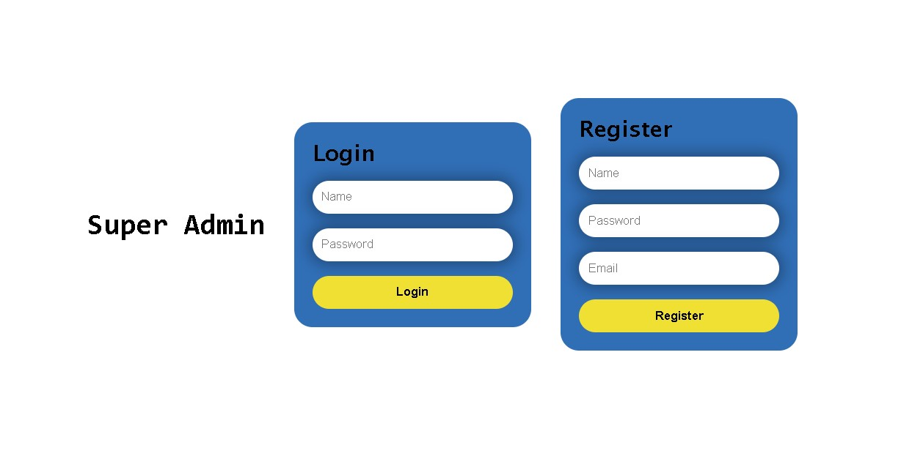

# Flask Authentication ✔️

Authentication Website with flask, sqlite and flask_login modules.

## Overview

Creating an application with 3 types of users "Super Admin", "Admin" & "Employees"

    Description :
    i) Simple login and list user app
    ii) there will be 3 routes and the root
    "/" root will display a page with 3 login buttons
    "/admin" {"Admin login page"}
    "/super" {"Super Admin login page"}
    "/user" {"Employee login page"}

    These 2 functionalites are important to implement.

    Extras :
        i) Listing sample products on "/user" page.
        ii) Listing all users on "/admin" page.
        iii) Listing all admis on "/super" page.

## Design Process


## Implementation

- Implemented the desing with three pages /user /admin /supersuer.
- working database and login functionaliy.
- run's on my machine 😼.

## Screenshots




## Installation

- Install all requirments.

```
pip install -r requirements.txt
```

- run main.py file.

```
python main.py
```
